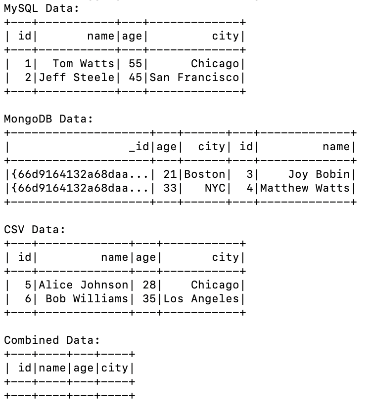
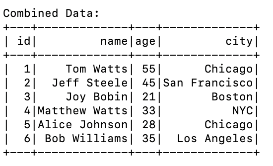
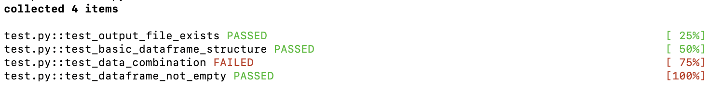
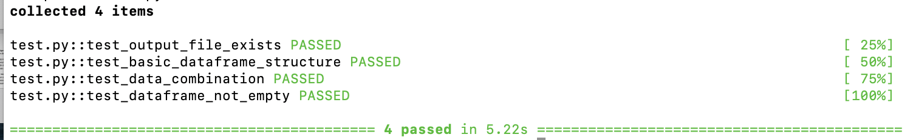

# Data Processing Pipeline Setup

## 1. Prerequisites
- Python 3.12
- OpenJDK 17
- MySQL 9.0.1
- MongoDB Community Edition 7.0


## 2. Required Connectors
- Download MySQL Connector/J (9.1.0) and save the jar file in an appriate directory for all future projects

## 3. Installation
Install the package in development mode:
```bash
# From the project root directory
pip install -e .
```

## 4. Database Configuration

### 4.1 MySQL Setup

1. Start MySQL service (if not already running)

2. Log in to MySQL as root:
   ```bash
   mysql -u root -p
   ```
   If prompted, enter your root password.

3. Create a new user:
   ```sql
   CREATE USER 'new_username'@'localhost' IDENTIFIED BY 'your_password';
   ```
   Replace 'new_username' and 'your_password' with your desired username and password.

4. Grant privileges to the new user:
   ```sql
   GRANT ALL PRIVILEGES ON *.* TO 'new_username'@'localhost' WITH GRANT OPTION;
   FLUSH PRIVILEGES;
   ```

5. Create a new database:
   ```sql
   CREATE DATABASE example;
   ```

6. Switch to the new database:
   ```sql
   USE example;
   ```

7. Create the "people" table:
   ```sql
   CREATE TABLE people (
     id INT PRIMARY KEY,
     name VARCHAR(50),
     age INT,
     city VARCHAR(50)
   );
   ```

8. Insert sample data:
   ```sql
   INSERT INTO people (id, name, age, city) VALUES 
   (1, 'Tom Watts', 55, 'Chicago'),
   (2, 'Jeff Steele', 45, 'San Francisco');
   ```

9. Verify the data:
   ```sql
   SELECT * FROM people;
   ```

10. Exit MySQL:
    ```sql
    EXIT;
    ```

### 4.2 MongoDB Setup

1. Start MongoDB service (if not already running)

2. Open MongoDB shell:
   ```bash
   mongosh
   ```

3. Create a new database:
   ```mongodb
   use example
   ```

4. Create a new collection and insert sample data:
   ```mongodb
   db.people.insertMany([
     { age: 21, city: "Boston", id: 3, name: "Joy Bobin" },
     { age: 33, city: "NYC", id: 4, name: "Matthew Watts" }
   ]);
   ```

5. Verify the data:
   ```mongodb
   db.people.find()
   ```

6. Exit MongoDB shell:
   ```mongodb
   exit
   ```

## 5. Environment Configuration

### 5.1 Setting Up Environment Variables

1. Create your local environment file:
   ```bash
   cp .env.example .env
   ```

2. Update the `.env` file with your database credentials and paths:
   ```bash
   # Database Connections
   MYSQL_CONNECTOR_PATH=/path/to/mysql-connector.jar
   MONGODB_URI=mongodb://localhost:27017
   MYSQL_URL=jdbc:mysql://localhost:3306/database_name
   MYSQL_USER=your_username
   MYSQL_PASSWORD=your_password

   # Database Names
   MONGO_DB=database_name
   MONGO_COLLECTION=collection_name
   MYSQL_TABLE=table_name

   # Data Paths
   CSV_PATH=/path/to/sample_data.csv
   OUTPUT_PATH=/path/to/output.csv
   ```

### 5.2 Project Structure
```
project-root/
├── setup.py           # Package setup file
├── .gitignore        # Git ignore patterns
├── .gitlab-ci.yml    # GitLab CI/CD configuration
├── src/
│   ├── __init__.py   # Makes src a Python package
│   ├── main.py       # Main application code
│   └── data_processor.py   # Data processing implementation
└── tests/
    ├── pytest.ini    # Test configuration and filters
    └── test_data.py  # Test suite
```

### 5.3 Security Practices

The CI pipeline will automatically check for:
- Code formatting using black
- No sensitive files (.env) in commits
- Protected files remain unchanged
- Required implementation in data_processor.py

To prepare your commit:
1. Format code: `black .`
2. Verify .env is in .gitignore
3. Only modify src/data_processor.py file
4. Review changes: `git status`

## 6. Running the Code

1. Make sure you're in the project root directory
2. Run the main script:
```bash
python src/main.py
```

Expected output:



After implementing the required methods in data_processor.py, your Combined Data should look like this:



## 7. Code Testing
Run the tests using the following command to see all the tests:
```bash
# From the project root directory
pytest -v
```

You can also run a specific test file:
```bash
pytest tests/test_data.py
```

Before implementing data_processor.py methods:



After implementing data_processor.py methods:



## 8. Submission Guidelines
1. Fork this repo
2. Create merge request
3. Run `black .` before your final commit
4. Pull changes from the original repository before submitting

